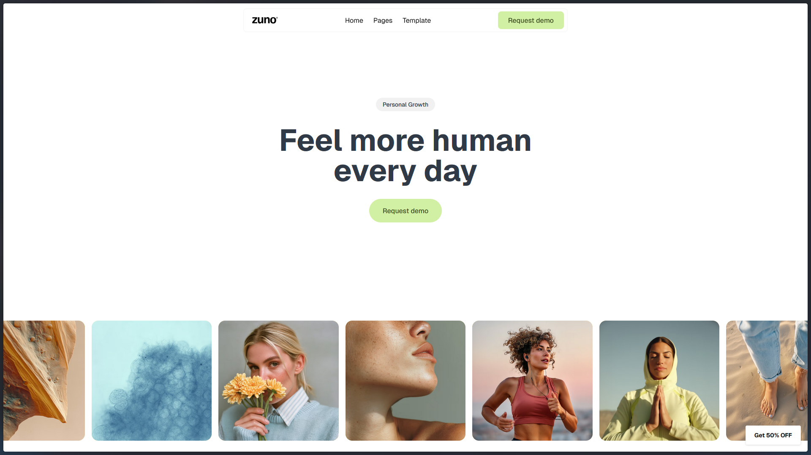

# Zuno – Demo Website

---

## 🌐 Live Demo

Try the live version here: https://zuno-amber.vercel.app/

## 📸 Preview



## 🚀 Tech Stack

- **Next.js (v15)** – App router, server-side rendering, optimized performance.
- **React (v19)** – Latest features including concurrent rendering.
- **Tailwind CSS (v4)** – Utility-first styling for responsive design.
- **Framer Motion (via `motion`)** – Smooth animations and transitions.
- **TypeScript (v5)** – Type safety and maintainable code.
- **ESLint & Prettier** – Enforced code quality and formatting.

---

## 📂 Project Highlights

- **Modern Architecture**: Built with the Next.js App Router for scalability.
- **Animations**: Leveraged `motion` for fluid, user-friendly interactions.
- **Hooks & Utilities**: Used `usehooks-ts` for cleaner React logic.
- **Best Practices**: Strict linting, prettier formatting, and type safety.

---

## 🛠️ Getting Started

To run the project locally:

```bash
# Clone repo
git clone <repository-url>
cd zuno

# Install dependencies
yarn install

# Start development server
yarn dev
```

The site will be available at:  
👉 [http://localhost:3000](http://localhost:3000)

---

## 📌 Scripts

- `yarn dev` – Start development server with Turbopack.
- `yarn build` – Create production build.
- `yarn start` – Run optimized production server.
- `yarn lint` – Run ESLint checks.

---

## 👨‍💻 Author

**Hasan Mahmud**
Frontend Developer

- 🌐 Portfolio: https://hasansujon786.github.io/
- 📧 Email: hasansujon786@gmail.com
